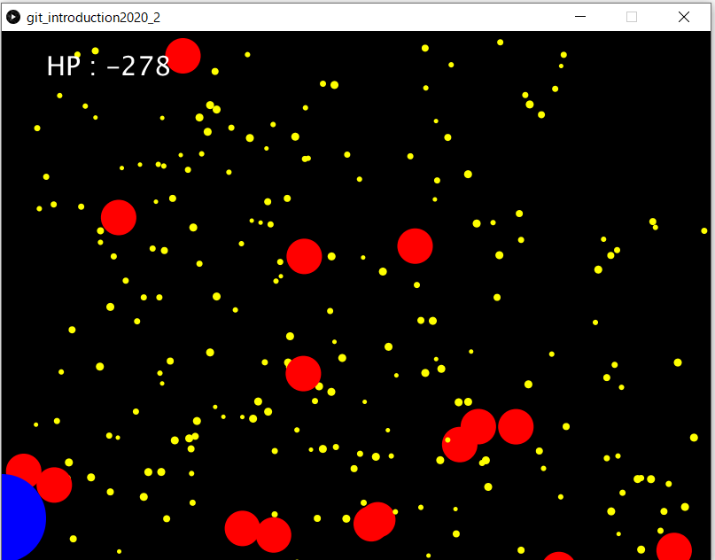

# git講習会課題 その2

チームでクラスを開発して、Masterリポジトリに統合しよう！
目標は画像のようにシューティングゲームが動くようになることです．

各々, 画像を使ったり，音を出したり，好きなように実装しましょう！

## 開発チーム

### ライオン㌠ (Bullet クラス)
- **Saito**
- Takeuchi
- Ushiyama

### うさぎ㌠ (Player クラス)
- **Manabe**
- Kameoka
- Kiuchi
- Sanada

### くま㌠ (Enemy クラス)
- **Hoshi**
- Naito
- Kaneko
- Kajimoto

### ぞう㌠ (World クラス)
- **Kaneda**
- Mizuta
- Zhang

# 手順
1. 各チームごとの自分のチームのブランチに移動します。
2. 各ブランチでクラスを一つ実装してください。
    - `Enemy.pde`
    - `Bullet.pde`
    - `World.pde`
    - `Player.pde`
    - の4つになります.
3. そのブランチの中で、さらに個人用のブランチに分かれて機能を一つ実装してください。

ブランチの分かれかたのイメージを画像に示します
チームごとに，実装する機能に合わせてブランチを切り，そのブランチから各人のブランチを切ります．

開発をする時には，GitHub の issue の機能など積極的に使ってみてください！
時には他のチームと話し合うことも必要かもしれません．

4. 開発した機能を各チームのブランチにマージします。
   - コンフリクトが起きた場合はチーム内で解決しましょう！
5. 最後にMasterブランチに統合して終了です
   - MasterブランチにPullRequest をなげてください．
6. 完成した作品は担当者が実行します。

# それぞれのクラス

## Player

- プレイヤが操作するオブジェクト
- HPを持っていて敵からの攻撃によって, HPが減っていきます．
  - 0になってしまったら GAMEOVER
- 何を実装するのも自由！
  - プレイヤーのアイコンを変えたり，発射する時に音を鳴らしたり...

### member

- `private PVector position`         : 位置座標
- `private int HP`                   : Hit Point
- `private int size`                 : 当たり判定領域
- `private ArrayList<Bullet> bullets`: 発射した弾たち

### `public void draw()`

- World からから呼ばれます．ここにPlayerを描画する処理を書いてください
  - 他の関数を実行したい場合は `draw`関数の中で実行するようにしてください.

### `public void keyPresssed(int key)`

- World からキーボード入力がそのまま渡されます

### 攻撃

### `public void shoot()`

- 弾を発射する関数 (例えば，何かキーが入力された時)
  - この弾はEnemyにダメージを与えることができる
  - 位置 (`pos`)，速度 (`vel`)，ダメージ量 (`dam`) で初期化します.
  - 発射した弾はリストとしてはPlayerのオブジェクトが持っています.
- `Bullet` の描画は Playerクラスが行います.

### 当たり判定

### `public void hitCheck()`

- `radius` が当たり判定エリアで, この領域内に弾が入ってきたら`当たり`になります.

### `public void hit(int damage)`

- 弾(`Bullet`)が当たった際の処理

### ゲッターやセッター

### `public ArrayList<Bullet> getBullets`

- 現在有効な発射した弾リストを返す

### `public PVector getPositon()`

- Player の現在位置を返す

### `public void setHP(int HP)`

- PlayerのHPをセットする

### `public int getHP()`

- Playerの現在のHPを返す

## Enemy

- 敵のクラス
- Worldクラスにenemy全体を管理する enemies というリストがあります．
- キーボードの`e` が押されるとEnemyが生成されます．
- 基本設計は守りつつ自由に実装しましょう！
  - アイコンを変えたり，弾から逃げる動きをしたり...

### member

- `private PVector position`         : 位置座標
- `private ArrayList<Bullet> bullets`: 発射した弾たち
- `private int size`                 : 当たり判定領域
- `public boolean is_dead`           : Dead or Alive

### `public void draw()`

- `draw` 関数がWorldクラスから呼ばれます．ここにEnemyを描画する処理を書いてください
  - 他の関数を実行したい場合は `draw`関数の中で実行するようにしてください.

### `public void keyPresssed(int key)`

- World からキーボード入力がそのまま渡されます

### 攻撃

### `public void shoot()`

- Enemyは弾 (`Bullet`) を発射します
  - この弾は Player にダメージを与えることができます
  - 位置 (`pos`)，速度 (`vel`)，ダメージ量 (`dam`) で初期化します.
  - 自分の発射した弾はリストとして各オブジェクトが持っています
- `Bullet` の描画は各Enemyが行います．

### 移動

- 基本, 自由に動き回ります.
- どう動かすかはあなた次第！

### 当たり判定

- `update` 内部で当たり判定の処理をしています．
- `radius` が当たり判定のエリアで，この領域とPlayerが発射した弾が重なると`当たり`になります．

### `public void hit()`

- Player の弾が当たったときの処理
- `is_dead` フラグを立てると，そのEnemyはWorldクラスの中で死亡判定されオブジェクトが削除されます

## Bullet

- 弾のクラス
- `Player`と`Enemy`はこの`Bullet`クラスを利用して弾を発射します.
- 各`Bullet`オブジェクトはダメージ量 (`dam`)を持っていて，敵やプレイヤにあたった場合，その分だけダメージを与えます
- 爆発させよう！！

### member

- `private PVector position`: 位置座標
- `private PVector velocity`: 弾の速度
- `private int damage`      : 与えるダメージ量

### `public void draw()`

- `draw` 関数によって弾の描画を行います．この関数は発射したオブジェクト(PlayerかEnemy)によって呼び出されます

### `public int getDamage()`

- 弾のダメージ量を返す

### `public PVector getPosition()`

- 弾の位置を PVector で返す

### 移動

### `void update()`

- `velocity`に合わせて位置 (`position`) を更新します.

## World

- Player や Enemy，及び背景の描画を担当するクラスです．
- `draw`関数がmainループから呼ばれており，Enemy.draw や Player.draw の呼び出しも行ってください
- なんでもできるゲームの支配者 _The World_

### member

- `int score`                        : スコア
- `private ArrayList<Player> players`: プレイヤーのリスト
- `private ArrayList<Enemy> ememies` : 敵のリスト

### `void init()`

- ゲーム開始時の処理

### `ArrayList<Player> getPlayers()`

- 現在アクティブのPlayerのリストを返す

### `ArrayList<Enemy> getEnemies()`

- 現在アクティブのEnemeyのリストを返す

### `void draw()`

- Playerなどを含めた全体の描画

### `void keyPressed(int key)`

- main ループから key が渡されてきます
- enemies と players にkey をそのまま流し込みます．
- また，key に対応した処理も実装します

### `void keyReleased(int key)`

- main ループから key が渡されてきます
- players にkey をそのまま流し込みます．
- また，key に対応した処理も実装します

# その他
- Masterで使う機能は表示したい内容によって変えても構いません。

